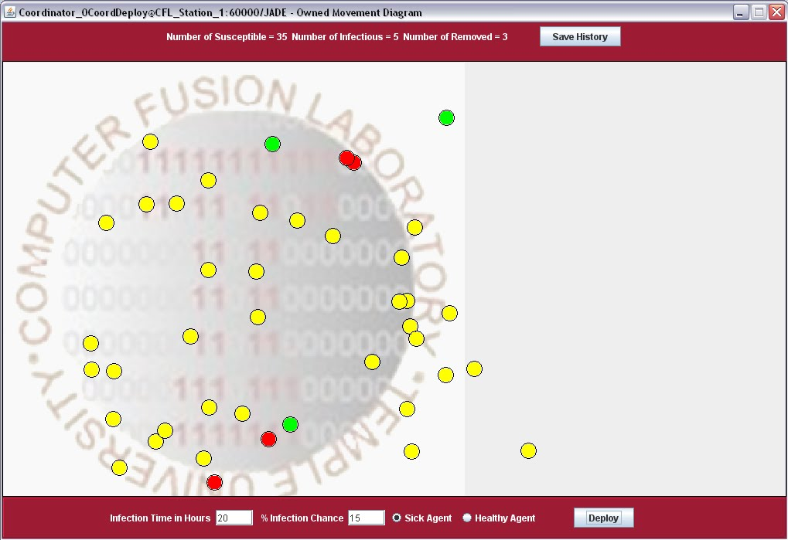

# Senior Design Project: Multi-Agent Simulation of an Epidemic

Temple University College of Engineering, Senior Design Group EE-09, spring 2010.

**Authors:** William R. Moser and Bilal A. Malik
**Advisers:** Dr. Li Bai and Dr. Saroj Biswas

Citizen agents move around a 2D grid on the [JADE](https://jade.tilab.com/) agent platform.
A coordinator agent tracks who is sick and spreads infection to citizens within range.
Agent behaviour was modelled graphically in the INGENIAS Development Kit, which generated the
JADE skeleton code; the simulation logic, path algorithm, and Swing GUI were then written by hand.



## Run it

Revived in September 2026 to build and run on a current JDK (tested on Temurin 26, macOS).
No Ant or NetBeans needed.

```sh
cd software/EE9v1_0
./build.sh
./run.sh
```

Two windows open: the JADE RMA console and the simulation window (Deploy, Kill, Save History).
Close the simulation window to exit. Agent state history is written to `data.txt`.

### What was changed to make it run

The original code targeted Java 1.5 on Windows XP. The revival touched as little as possible:

- `lib/jade.jar` manifest: removed a Windows-style `Class-Path` entry that modern `javac` rejects.
- `compat/`: 15-line shim for `sun.misc.Compare` and `sun.misc.Sort`, which were removed from the JDK
  but are still used by the INGENIAS runtime (`lib/modiaf.jar`). Loaded via `--patch-module jdk.unsupported`.
- One source line in `AgentWindowAppAppImp.java`: history file path `C:/data.txt` became `data.txt`.
- Added `build.sh` and `run.sh`.

Everything else is the 2010 code as written. `software/EE9v1_0_original.zip` is the untouched original.

## Layout

| Path | Contents |
| --- | --- |
| `software/EE9v1_0/` | Revived source, bundled libraries, build and run scripts |
| `software/EE9v1_0_original.zip` | Original 2010 release, byte-for-byte |
| `docs/reports/` | Final report (PDF and Word) |
| `docs/archived_pages/` | Project website pages captured from the Internet Archive |
| `docs/images/original/` | Poster, report cover, team photo, and BMP screenshots as archived |
| `docs/images/preview/` | JPEG renditions of the screenshots |
| `docs/RECOVERY_NOTES.txt` | Where the archived material came from |

The project website was hosted on Google Sites at `sites.google.com/a/temple.edu/sd-ee9-2010`
and was recovered from Wayback Machine captures dated October 2020.
